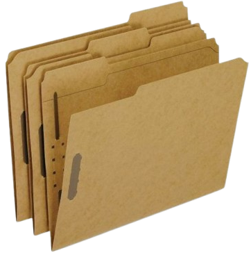

# Joice Portfolio Website Design



> A modern, interactive portfolio website built with React, showcasing UI/UX design projects, illustrations, and branding with smooth animations and a unique user experience.

## 🌟 Key Features

This website is designed with a focus on interactivity and visual aesthetics:

* **Interactive Landing Page**: 3D folder animation and visual elements that respond to mouse movement.
* **Mouse Interactions**: "Eyes" that follow the cursor and a custom cursor that provides visual feedback on hover.
* **Smooth Transitions**: Seamless page and element transitions powered by **Framer Motion**.
* **Project Showcase**: A detailed gallery of projects (Mobile Apps, Branding, Illustrations) with full-view details.
* **Responsive Design**: Optimized layout for various device sizes (Desktop, Tablet, Mobile).
* **Modern UI Components**: Built using headless components (Radix UI) customized with Tailwind CSS (shadcn/ui style).

## 🛠️ Tech Stack

This project is built using a modern technology stack:

* **Core**: [React](https://react.dev/) (v18) with [TypeScript](https://www.typescriptlang.org/).
* **Build Tool**: [Vite](https://vitejs.dev/) - For fast development and optimized builds.
* **Styling**: [Tailwind CSS](https://tailwindcss.com/) - Utility-first CSS framework.
* **Animations**: [Framer Motion](https://www.framer.com/motion/) - Animation library for React.
* **Icons**: [Lucide React](https://lucide.dev/).
* **UI Components**:
    * [Radix UI](https://www.radix-ui.com/) (Primitives for Dialog, Tooltip, Accordion, etc.)
    * [Sonner](https://sonner.emilkowal.ski/) (Toast notifications)
    * [Vaul](https://github.com/emilkowalski/vaul) (Drawer component)
    * [Recharts](https://recharts.org/) (Data visualization)

## 📋 Prerequisites

Before you begin, ensure you have the following installed:

* [Node.js](https://nodejs.org/) (Version 18 or later recommended)
* A package manager like `npm`, `yarn`, or `pnpm`

## 🚀 Installation and Usage

Follow these steps to run the project on your local machine:

1.  **Clone the repository:**
    ```bash
    git clone [https://github.com/joicenapitupulu/portofolio-website2.git](https://github.com/joicenapitupulu/portofolio-website2.git)
    cd portofolio-website2
    ```

2.  **Install dependencies:**
    ```bash
    npm install
    # or if using yarn
    yarn install
    ```

3.  **Start the development server:**
    ```bash
    npm run dev
    ```
    Open your browser and navigate to `http://localhost:3000` (or the port shown in your terminal).

4.  **Build for production:**
    To create an optimized version ready for deployment:
    ```bash
    npm run build
    ```
    The build output will be located in the `dist` directory.

## 📂 Project Structure

Here is an overview of the project's directory structure:

```text
root/
├── public/              # Static public assets
├── src/
│   ├── assets/          # Project images (branding, app screenshots, etc.)
│   ├── components/      # React components
│   │   ├── figma/       # Components for design asset integration
│   │   ├── ui/          # Reusable UI components (Button, Dialog, Card, etc.)
│   │   ├── About.tsx    # "About Me" section
│   │   ├── Contact.tsx  # Contact form section
│   │   ├── Hero.tsx     # Hero / Intro section
│   │   ├── Navigation.tsx # Navbar component
│   │   ├── PortfolioContent.tsx # Main portfolio content grid
│   │   ├── PortfolioLanding.tsx # Interactive landing page (Folder animation)
│   │   ├── ProjectDetail.tsx    # Project detail view
│   │   └── Skills.tsx   # Skills section
│   ├── styles/          # Global CSS files
│   ├── App.tsx          # Main application component
│   ├── main.tsx         # React entry point
│   └── vite-env.d.ts
├── index.html           # HTML Entry point
├── package.json         # Dependencies and scripts
├── tailwind.config.js   # Tailwind configuration
├── tsconfig.json        # TypeScript configuration
└── vite.config.ts       # Vite configuration & Alias Paths
```
## 💡 Usage Example / Navigation Flow
Landing: Users are greeted with a closed folder animation. Click the folder to "open" the portfolio.

Exploration: Scroll down to view the About, Skills, and Projects sections.

Project Details: Click on any project card (e.g., "Whoosh Train Booking" or "Joydee App") to view the full case study, tools used, and demo links.

Contact: Use the form at the bottom to send a message or view social media links.

## 🤝 Contribution
Contributions are welcome! If you'd like to improve features or fix bugs:

Fork the repository.

Create a new feature branch (git checkout -b feature-cool-feature).

Commit your changes (git commit -m 'Add some cool feature').

Push to the branch (git push origin feature-cool-feature).

Open a new Pull Request.
